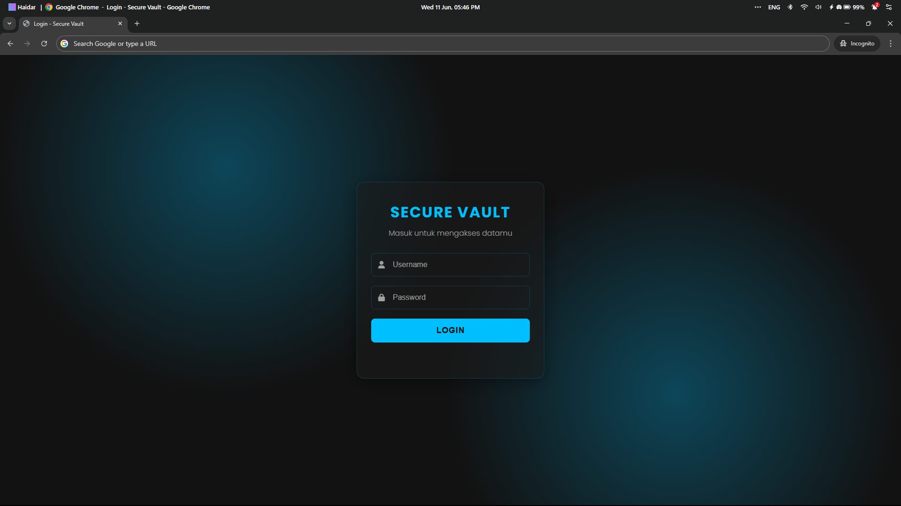
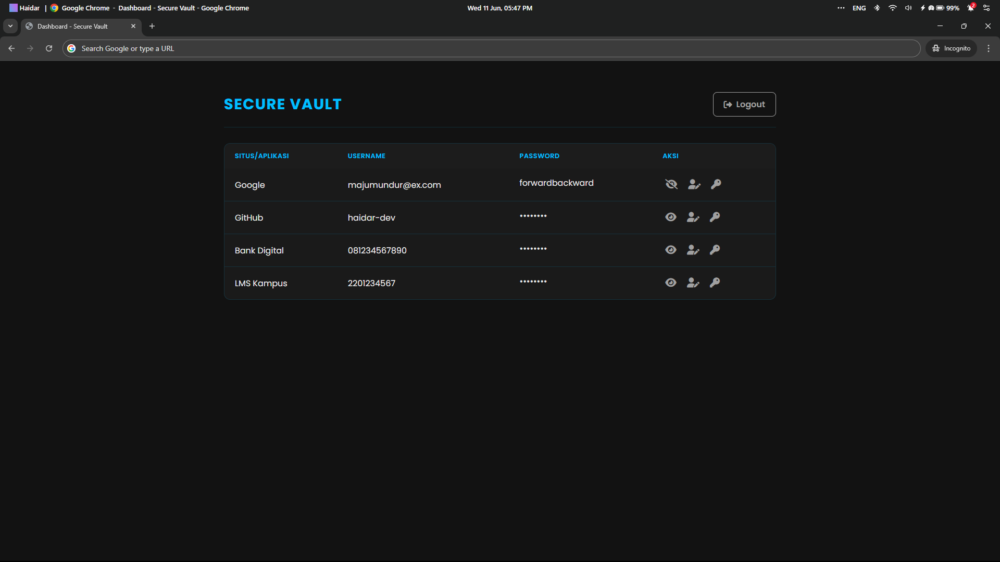
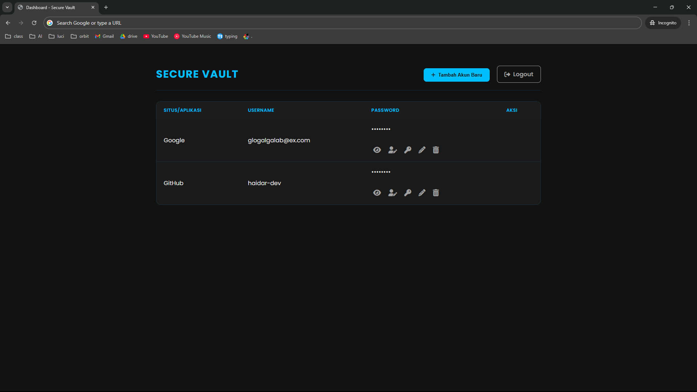
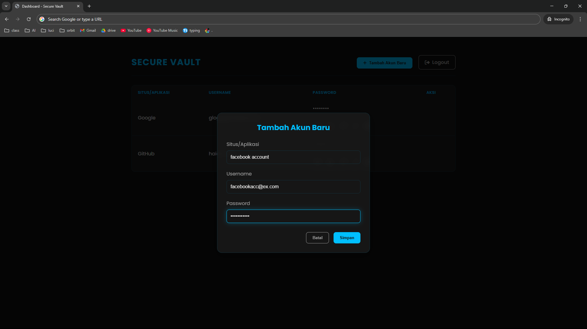
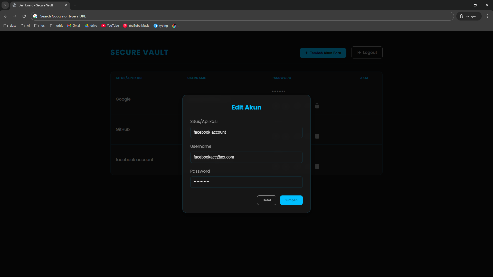

# Secure Vault - Manajer Password Pribadi

Aplikasi web 100% client-side untuk mengelola dan menyimpan password secara lokal di dalam browser, dibuat sebagai proyek latihan untuk mendalami konsep HTML, CSS, JavaScript, dan Web Storage API (`localStorage`).

---

##  Tampilan Aplikasi (Desain Awal)

  
  &nbsp;&nbsp;&nbsp;&nbsp;
  

##  Tampilan Fitur v2 (Fungsionalitas CRUD)

  
  &nbsp;
  
  &nbsp;
  

> *Dari kiri ke kanan: Tampilan dashboard baru dengan tombol Edit & Hapus, Modal pop-up untuk menambah akun, dan Modal untuk mengedit akun yang sudah ada.*

---

##  Konsep & Cara Kerja

Aplikasi ini adalah **Client-Side Application**. Artinya, tidak ada server backend yang memproses atau menyimpan data. Semua logika, tampilan, dan penyimpanan terjadi sepenuhnya di dalam browser pengguna, menggunakan `localStorage` sebagai databasenya. Setiap pengguna memiliki data yang terisolasi dan pribadi.

---

##  Fitur Utama

- **Otentikasi Lokal:** Halaman login sederhana untuk melindungi akses ke dashboard.
- **CRUD Penuh:** Fungsionalitas **Create, Read, Update, & Delete** untuk mengelola data password.
- **Penyimpanan Persisten:** Menggunakan **`localStorage`** browser untuk menyimpan data secara permanen.
- **Fitur Bantuan:** Tombol "Copy to Clipboard" dan "Toggle Visibility".
- **Desain Modern & Responsif:** Antarmuka yang elegan dengan tema gelap.

---

##  Catatan Pembaruan Terbaru (Upgrade ke v2.0)

Versi terbaru dari Secure Vault ini merupakan perombakan total dari versi awalnya. Fokus utama adalah mengubah aplikasi dari "penampil data" statis menjadi manajer password yang dinamis dan interaktif. Berikut adalah rincian pembaruan utamanya:

* **Perubahan Fundamental Mekanisme Penyimpanan:**
    * **Dari `data.js` ke `localStorage`:** Aplikasi tidak lagi membaca data secara langsung dari file `data.js`. Sekarang, semua data password disimpan dan dikelola di dalam `localStorage` browser.
    * **Peran Baru `data.js`:** File `data.js` kini hanya berfungsi sebagai "bibit data" yang akan dimuat ke `localStorage` **hanya saat aplikasi pertama kali dijalankan**.

* **Implementasi Fungsionalitas CRUD Penuh:**
    * **CREATE (Tambah):** Menambahkan tombol "Tambah Akun Baru" yang memunculkan sebuah modal untuk memasukkan data baru.
    * **UPDATE (Edit):** Setiap baris data kini memiliki tombol "Edit" (ikon pensil) untuk mengubah detail.
    * **DELETE (Hapus):** Menambahkan tombol "Hapus" (ikon tong sampah) lengkap dengan jendela konfirmasi.

* **Peningkatan Antarmuka & Pengalaman Pengguna (UI/UX):**
    * **Modal Interaktif:** Alur kerja yang lebih intuitif dengan form pop-up untuk semua aksi penambahan dan pengeditan data.
    * **Notifikasi "Toast":** Mengganti `alert()` dengan notifikasi yang tidak mengganggu untuk memberikan umpan balik.

---

##  Teknologi yang Digunakan

- **Frontend:** HTML5, CSS3 (Flexbox), JavaScript (ES6)
- **Web Storage API:** `localStorage`
- **Ikon:** Font Awesome
- **Version Control:** Git & GitHub

---

##  Cara Menjalankan Secara Lokal

1.  **Clone repository ini.**
2.  **Masuk ke direktori proyek.**
3.  **Buka file `index.html`** langsung di browser.
4.  **Login ke Aplikasi** menggunakan kredensial dari `script.js`:
    - **Username:** `user`
    - **Password:** `password`
5.  **Mulai Kelola Data:** Data contoh dari `data.js` akan dimuat saat pertama kali dijalankan. Selanjutnya, semua datamu akan tersimpan di `localStorage` browser-mu.

---

## ⚠️ Peringatan Keamanan

- **HANYA UNTUK LATIHAN:** Dirancang **khusus untuk tujuan pembelajaran**.
- **DATA TIDAK TERENKRIPSI:** Data di `localStorage` tidak terenkripsi dan dapat dilihat oleh siapa saja dengan akses fisik ke komputer melalui **Developer Tools (F12)**.
- **JANGAN GUNAKAN PASSWORD ASLI.**
- **REPOSITORY HARUS PRIVATE.**

---

##  Rencana Pengembangan

- [x]  **Menggunakan `localStorage` browser untuk menyimpan data.**
- [ ]  Menambahkan fitur enkripsi sederhana (misal Base64) sebelum menyimpan data.
- [ ]  Menambahkan fungsionalitas pencarian untuk memfilter data di tabel.
- [ ]  Memberikan opsi tema (terang/gelap) kepada pengguna.