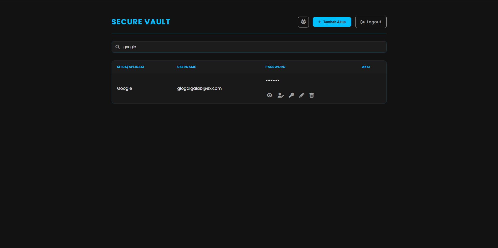
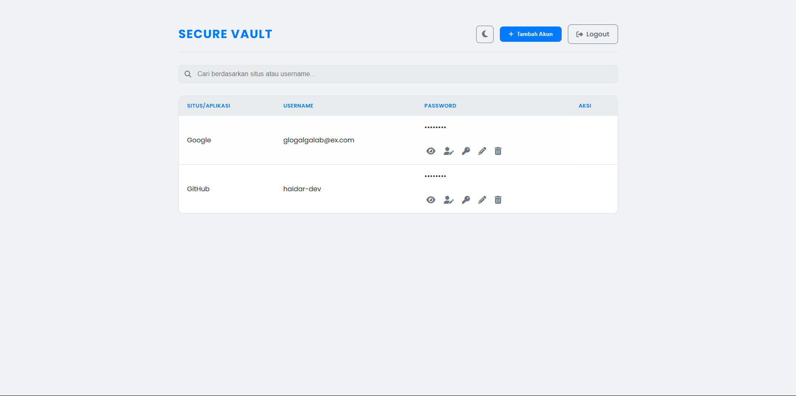

# Secure Vault - Manajer Password Pribadi

Aplikasi web 100% client-side untuk mengelola dan menyimpan password secara lokal di dalam browser. Proyek ini berevolusi dari penampil data statis menjadi aplikasi interaktif dengan fungsionalitas penuh.

---

##  Tampilan & Fitur Aplikasi

Berikut adalah showcase dari evolusi tampilan dan fitur Secure Vault.

#### v3.0 - Fitur Lanjutan (Pencarian & Tema)

  
  &nbsp;
  

#### v2.0 - Fungsionalitas CRUD

  
  &nbsp;
  
  &nbsp;
  

#### v1.0 - Desain Awal

  
  &nbsp;&nbsp;&nbsp;&nbsp;
  

---

##  Riwayat Pembaruan (Changelog)

### v3.0 - Fitur Lanjutan & Peningkatan UX (Update Terbaru)
*Tanggal: 11 Juni 2025*
- **Menambahkan Fungsionalitas Pencarian:** Mengimplementasikan kolom pencarian *real-time* untuk memfilter data di tabel berdasarkan situs atau username.
- **Memberikan Opsi Tema (Terang/Gelap):** Menambahkan tombol untuk beralih antara tema gelap (default) dan tema terang. Pilihan pengguna disimpan di `localStorage` agar persisten.
- **Menerapkan Enkripsi Sederhana (Base64):** Semua data password kini di-encode ke format Base64 sebelum disimpan di `localStorage` untuk menyamarkan data dari penglihatan biasa.

### v2.0 - Aplikasi Interaktif dengan `localStorage`
- **Migrasi Penyimpanan ke `localStorage`:** Mengubah fundamental aplikasi dari membaca file `data.js` statis menjadi menggunakan `localStorage` browser. Ini memungkinkan data menjadi dinamis dan personal untuk setiap pengguna.
- **Implementasi Fungsionalitas CRUD Penuh:**
  - **Create:** Fitur "Tambah Akun" melalui form modal.
  - **Update:** Fitur "Edit" data yang sudah ada.
  - **Delete:** Fitur "Hapus" data dengan konfirmasi.
- **Peningkatan UX dengan Notifikasi "Toast":** Mengganti `alert()` dengan notifikasi yang lebih modern dan tidak mengganggu.

### v1.0 - Rilis Awal (Read-Only)
- **Desain Antarmuka Futuristik:** Membangun desain awal aplikasi dengan tema gelap hitam-biru.
- **Fungsionalitas Dasar:** Aplikasi hanya dapat menampilkan data password yang di-hardcode di dalam file `data.js`.
- **Fitur Bantuan:** Tombol "Copy to Clipboard" dan "Toggle Visibility" untuk password.

---

##  Teknologi yang Digunakan

- **Frontend:** HTML5, CSS3 (Flexbox & CSS Variables), JavaScript (ES6)
- **Web Storage API:** `localStorage`
- **Ikon:** Font Awesome
- **Version Control:** Git & GitHub

---

##  Cara Menjalankan

1.  Clone repository ini.
2.  Buka file `index.html` langsung di browser.
3.  Login menggunakan: Username: `user`, Password: `password`.
4.  Aplikasi siap digunakan.

---

## ⚠️ Peringatan Keamanan

- **UNTUK LATIHAN:** Dirancang **khusus untuk tujuan pembelajaran**.
- **ENKRIPSI LEMAH:** Base64 adalah *encoding*, bukan enkripsi kuat. Data dapat dengan mudah di-decode.
- **JANGAN GUNAKAN PASSWORD ASLI.**